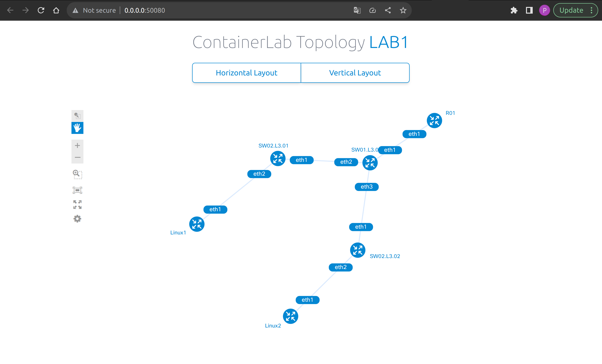

University: [ITMO University](https://itmo.ru/ru/)  
Faculty: [FICT](https://fict.itmo.ru)  
Course: [Introduction in routing](https://github.com/itmo-ict-faculty/introduction-in-routing)  
Year: 2023/2024  
Group: K33212  
Author: Polina Igorevna Zvoda          
Lab: Lab1  
Date of create: 04.09.2023  
Date of finished: 30.09.2023  


## Лабораторная работ №1 "Установка ContainerLab и развертывание тестовой сети связи"

## Цель работы
Ознакомиться с инструментом ContainerLab и методами работы с ним, изучить работу VLAN, IP адресации и т.д.

## Ход работы   

### Сеть
Создание трехуровневой сети связи классического предприятия.
```
name: lab1

topology:
  nodes:
    R01:
      kind: vr-ros
      image: vrnetlab/vr-routeros:6.47.9
      mgmt-ipv4: 192.168.50.2

    Linux1:
      kind: linux
      image: alpine:latest
      cmd: sleep infinity
      mgmt-ipv4: 192.168.50.3

    Linux2:
      kind: linux
      image: alpine:latest
      cmd: sleep infinity
      mgmt-ipv4: 192.168.50.4
      
    SW01.L3.01:
      kind: vr-ros
      image: vrnetlab/vr-routeros:6.47.9
      mgmt-ipv4: 192.168.50.5

    SW02.L3.01:
      kind: vr-ros
      image: vrnetlab/vr-routeros:6.47.9
      mgmt-ipv4: 192.168.50.6

    SW02.L3.02:
      kind: vr-ros
      image: vrnetlab/vr-routeros:6.47.9
      mgmt-ipv4: 192.168.50.7

  links:
      - endpoints: ["R01:eth1", "SW01.L3.01:eth1"]
      - endpoints: ["SW01.L3.01:eth2", "SW02.L3.01:eth1"]
      - endpoints: ["SW02.L3.01:eth2", "Linux1:eth1"]
      - endpoints: ["SW01.L3.01:eth3", "SW02.L3.02:eth1"]
      - endpoints: ["SW02.L3.02:eth2", "Linux2:eth1"]
      
mgmt:
  network: static
  ipv4-subnet: 192.168.50.0/24
```

Топология сети после сборки представлена на фото ниже ```sudo containerlab deploy networklab.yaml```:  
```sudo containerlab graph```  



## Настройка роутера R01

  


## Настройка SW01.L3.01 

  


## Настройка SW02.L3.01


## Настройка SW02.L3.02


## Проверка доступности


## Вывод
В результате лабораторной работы удалось ознакомиться с инструментом ContainerLab, а также создать сеть и настроить устройства на базе ОС Linux и RouterOS.


