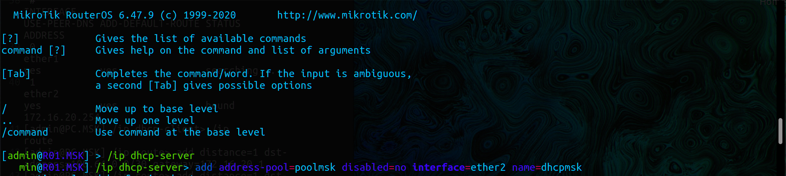
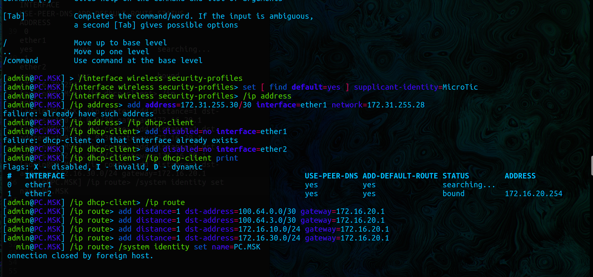
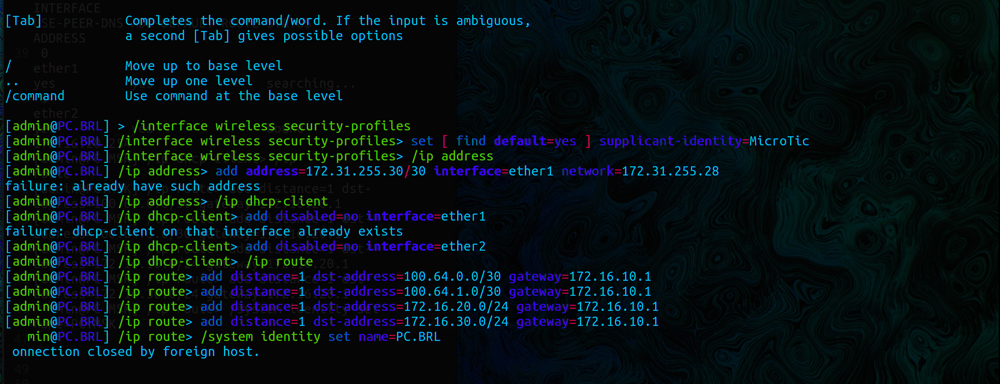

University: [ITMO University](https://itmo.ru/ru/)  
Faculty: [FICT](https://fict.itmo.ru)  
Course: [Introduction in routing](https://github.com/itmo-ict-faculty/introduction-in-routing)  
Year: 2023/2024  
Group: K33212  
Author: Polina Igorevna Zvoda   
Lab: Lab2  
Date of create: 1.10.2023  
Date of finished: 30.10.2023  

## Лабораторная работа №2 "Эмуляция распределенной корпоративной сети связи, настройка статической маршрутизации между филиалами"
 

## Ход работы

### Схема сети

1. Создание схемы сети

### Настройка роутеров

1. Роутер MSK.

2. Роутер FRT.

3. Роутер BRL.

### Настройка компьютеров  

1. Настройка компьютера в Москве

2. Настройка компьютера во Франкфурте  

3. Настройка компьютера в Берлине 

## Проверка доступности 

1. MSK -> BRL; MSK -> FRT

2. FRT -> BRL; FRT -> MSK

3. BRL -> MSK; BRL -> FRT

## Вывод
В результате лабораторной работы удалось ознакомиться с принципами планирования IP адресов, настройки статической маршрутизации и сетевыми функциями устройств.

