University: [ITMO University](https://itmo.ru/ru/)  
Faculty: [FICT](https://fict.itmo.ru)  
Course: [Introduction in routing](https://github.com/itmo-ict-faculty/introduction-in-routing)  
Year: 2023/2024  
Group: K33212  
Author: Polina Igorevna Zvoda  
Lab: Lab3  
Date of create: 01.11.2023  
Date of finished: 11.12.2023  

## Лабораторная работа №3 "Эмуляция распределенной корпоративной сети связи, настройка OSPF и MPLS, организация первого EoMPLS"

## Цель работы
Изучить протоколы OSPF и MPLS, механизмы организации EoMPLS.

## Ход работы

### PC1 и Router SPB

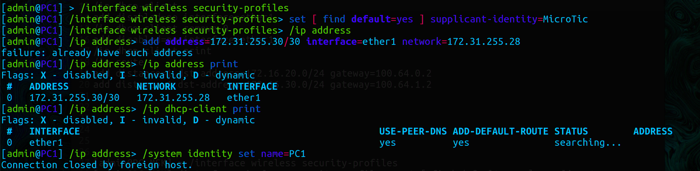

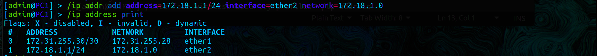

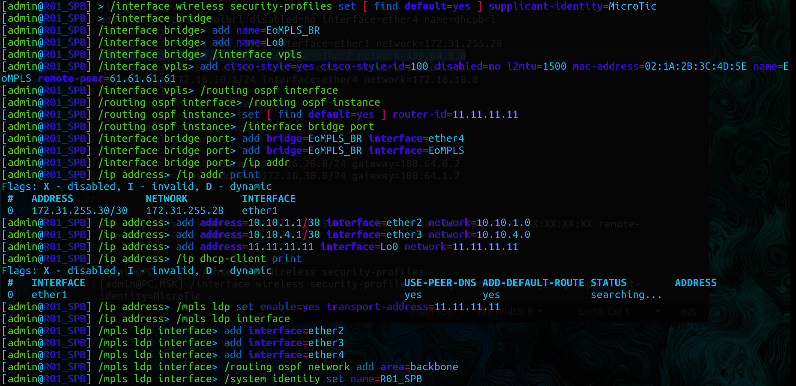

### Routers HKI; MSK; LBN; LND

Настройка роутера HKI

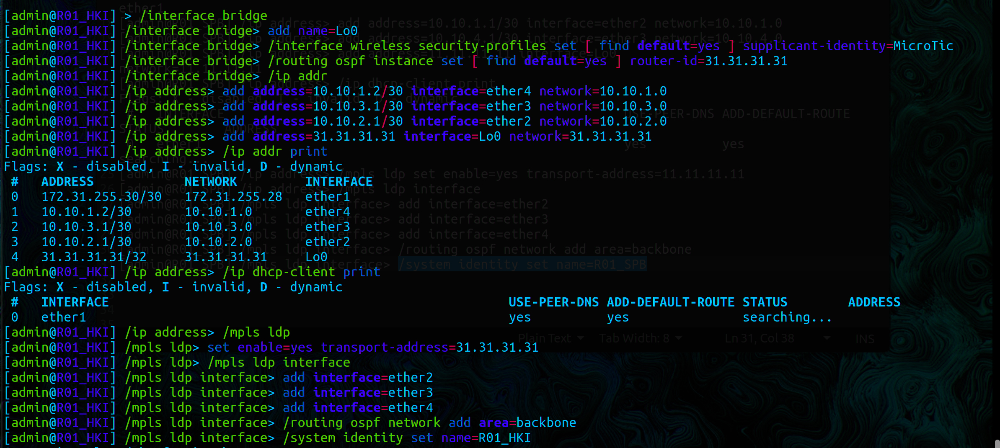

Настройка роутера MSK

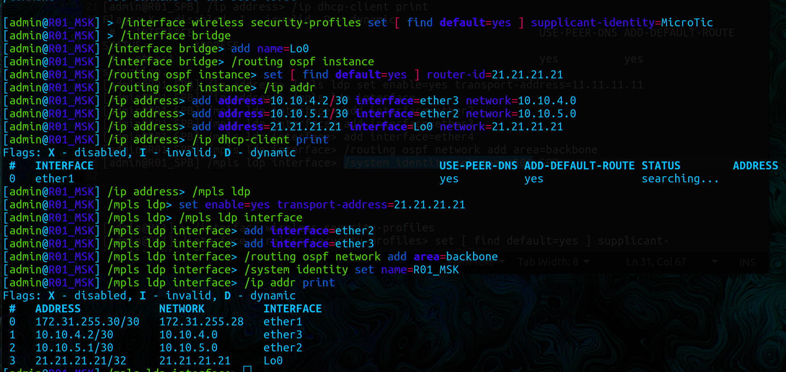

Настройка роутера LBN

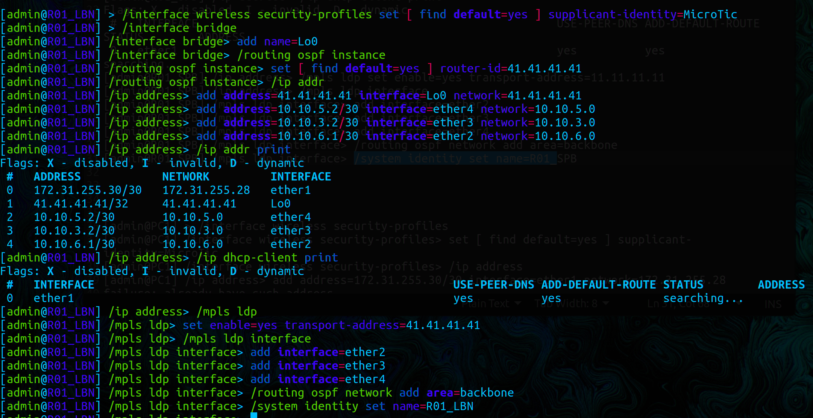

Настройка роутера LND

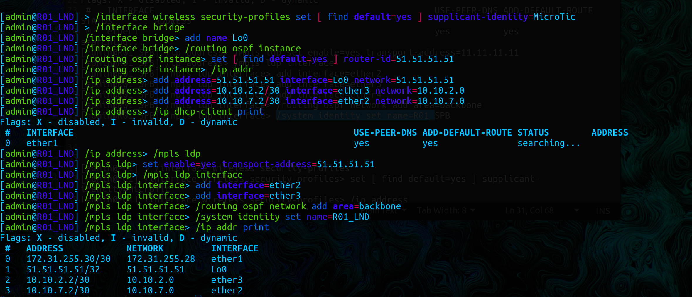

### SGI_Prism и Router NYC

Настройка роутера NYC

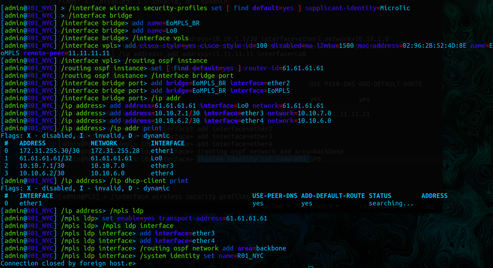

Настройка SGI_Prism

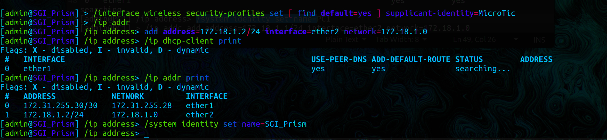

### Проверка

Результат конфигурации MPLS

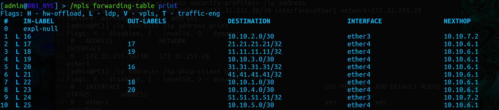

 
Отслеживание маршрута от роутера NYC до роутера SPB

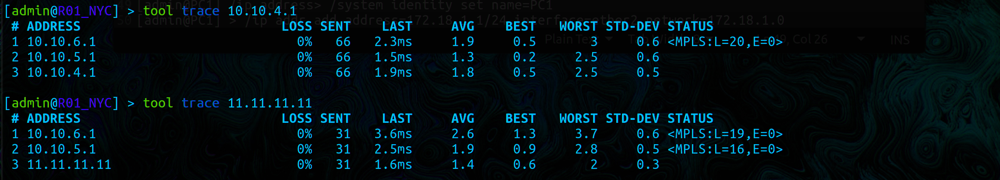

icmp запрос от SGI_Prism к PC1

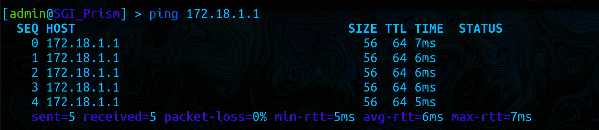

## Вывод

В результате лабораторной работы удалось ознакомиться на практике с протоколами OSPF, MPLS, EoMPLS и механизмами их организации.
