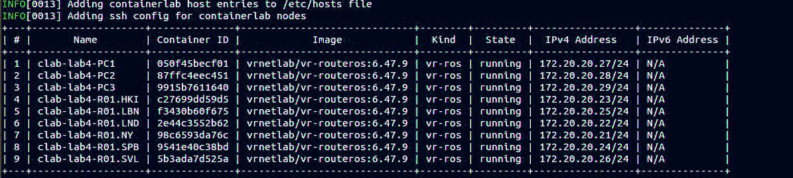
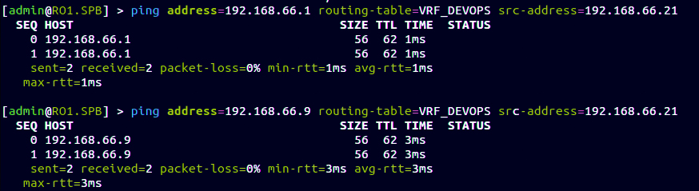
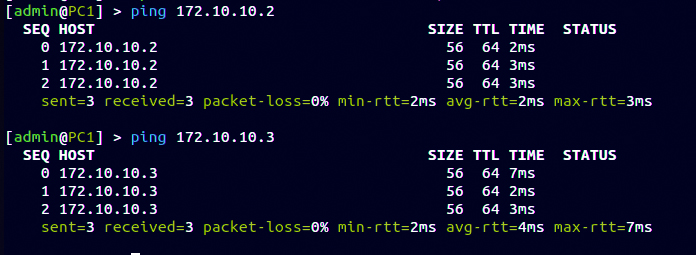

University: ITMO University    
Faculty: FICT  
Course: Introduction in routing   
Year: 2023/2024  
Group: K33212  
Author: Polina Igorevna Zvoda  
Lab: Lab4    
Date of create: 11.12.2023  
Date of finished: 15.12.2023  

# Отчёт по лабораторной работе #4

## Цель работы 
Изучить протоколы BGP, MPLS и правила организации L3VPN и VPLS.

## Ход работы 
### Развертывание тестовой сети

<p align=center></p>


### Топология полученной сети

<p align=center></p>


### Настройка VRF

### RO1.HKI

```
add name=Lo
/interface wireless security-profiles
set [ find default=yes ] supplicant-identity=MikroTik
/routing ospf instance
set [ find default=yes ] router-id=10.0.14.1
/ip address
add address=172.31.255.30/30 interface=ether1 network=172.31.255.28
add address=172.40.40.18/30 interface=ether2 network=172.40.40.0
add address=10.0.14.1 interface=Lo network=10.0.14.1
add address=172.40.40.14/30 interface=ether3 network=172.40.40.0
add address=172.40.40.21/30 interface=ether4 network=172.40.40.0
/ip dhcp-client
add disabled=no interface=ether1
/mpls ldp
set enabled=yes
/mpls ldp interface
add interface=ether2
add interface=ether3
add interface=ether4
/routing bgp peer
add address-families=ip,l2vpn,l2vpn-cisco,vpnv4 name=peer1 remote-address=10.0.11.1 remote-as=65530 \
    route-reflect=yes update-source=Lo
add address-families=ip,l2vpn,l2vpn-cisco,vpnv4 name=peer2 remote-address=10.0.12.1 remote-as=65530 \
    route-reflect=yes update-source=Lo
add address-families=ip,l2vpn,l2vpn-cisco,vpnv4 name=peer3 remote-address=10.0.15.1 remote-as=65530 \
    update-source=Lo
/routing ospf network
add area=backbone
/system identity
set name=R01.HKI
```

### RO1.SPB

```
add name=Lo
/interface wireless security-profiles
set [ find default=yes ] supplicant-identity=MikroTik
/routing bgp instance
set default router-id=10.0.15.1
/routing ospf instance
set [ find default=yes ] router-id=10.0.15.1
/ip address
add address=172.31.255.30/30 interface=ether1 network=172.31.255.28
add address=10.0.15.1 interface=Lo network=10.0.15.1
add address=172.40.40.2/30 interface=ether2 network=172.40.40.0
add address=192.168.66.21/30 interface=ether3 network=192.168.66.20
/ip dhcp-client
add disabled=no interface=ether1
/ip route vrf
add export-route-targets=65530:100 import-route-targets=65530:100 interfaces=ether3 \
    route-distinguisher=65530:100 routing-mark=VRF_DEVOPS
/mpls ldp
set enabled=yes
/mpls ldp interface
add interface=ether2
/routing bgp instance vrf
add redistribute-connected=yes routing-mark=VRF_DEVOPS
/routing bgp peer
add address-families=ip,l2vpn,l2vpn-cisco,vpnv4 name=peer1 remote-address=10.0.14.1 remote-as=65530 \
    update-source=Lo
/routing ospf network
add area=backbone
/system identity
set name=R01.SPB
```

### Проверка подключения

<p align=center></p>


### Настройка VPLS

### RO1.SPB

```
add name=Lo
add name=VPLS
/interface vpls
add disabled=no l2mtu=1500 mac-address=02:2D:B2:04:58:B5 name=vpls1 remote-peer=10.0.10.1 vpls-id=10:0
add disabled=no l2mtu=1500 mac-address=02:07:F9:C5:13:11 name=vpls2 remote-peer=10.0.13.1 vpls-id=10:0
/interface wireless security-profiles
set [ find default=yes ] supplicant-identity=MikroTik
/routing bgp instance
set default router-id=10.0.15.1
/routing ospf instance
set [ find default=yes ] router-id=10.0.15.1
/interface bridge port
add bridge=VPLS interface=ether3
add bridge=VPLS interface=vpls1
add bridge=VPLS interface=vpls2
/ip address
add address=172.31.255.30/30 interface=ether1 network=172.31.255.28
add address=10.0.15.1 interface=Lo network=10.0.15.1
add address=172.40.40.22/30 interface=ether2 network=172.40.40.0
add address=192.168.66.21/30 interface=ether3 network=192.168.66.0
/ip dhcp-client
add disabled=no interface=ether1
/mpls ldp
set enabled=yes
/mpls ldp interface
add interface=ether2
/routing bgp peer
add address-families=ip,l2vpn,l2vpn-cisco,vpnv4 name=peer1 remote-address=10.0.14.1 remote-as=65530 \
    update-source=Lo
/routing ospf network
add area=backbone
/system identity
set name=R01.SPB
```

### Проверка подключения

<p align=center></p>


### Вывод

В результате лабораторной работы удалось ознакомиться на практике с протоколами BGP, MPLS и правилами организации L3VPN и VPLS. В отчете рассмотрена только настройка ветки HKI-SPB-PC1 в силу симметрии всей сети. 